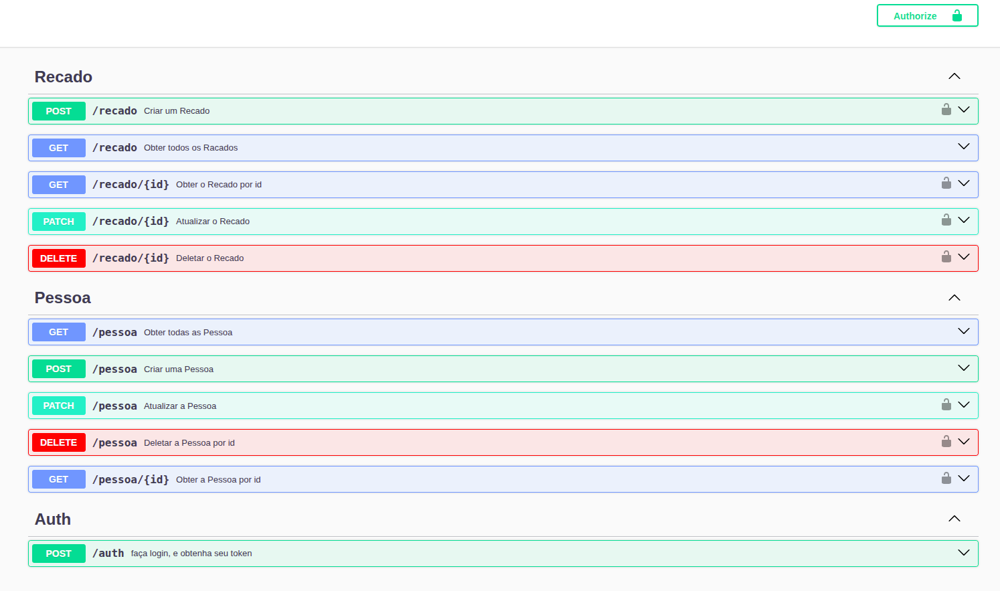

# 📬 Recados API

API RESTful para envio de recados entre pessoas.

Desenvolvida com **NestJS**, utilizando **TypeORM**, **PostgreSQL**, **JWT Authentication** e documentação automática com **Swagger**.

---

## 🚀 Live API

A API está disponível em:

🔗 https://apirestfull-nestjs-d529.onrender.com/docs

A documentação interativa pode ser acessada diretamente no **Swagger UI**.

---

## 📚 API Documentation

A API possui documentação automática usando **Swagger**, onde é possível visualizar e testar todos os endpoints.

---

## 🛠️ Technologies

- NestJS
- TypeScript
- TypeORM
- PostgreSQL
- JWT Authentication
- Docker
- Swagger

---

## 📦 Features

- Autenticação com JWT
- CRUD de Pessoas
- CRUD de Recados
- Relacionamento entre Pessoas e Recados
- Documentação interativa com Swagger

---

# 📡 Endpoints

## 🔐 Authentication

| Method | Endpoint | Description |
|------|------|------|
| POST | `/auth` | Realiza login e retorna o token JWT |

---

## 👤 Pessoa

| Method | Endpoint | Description |
|------|------|------|
| GET | `/pessoa` | Listar todas as pessoas |
| GET | `/pessoa/{id}` | Buscar pessoa por id |
| POST | `/pessoa` | Criar uma nova pessoa |
| PATCH | `/pessoa` | Atualizar pessoa |
| DELETE | `/pessoa` | Deletar pessoa |

---

## 💬 Recados

| Method | Endpoint | Description |
|------|------|------|
| GET | `/recado` | Listar recados |
| GET | `/recado/{id}` | Buscar recado por id |
| POST | `/recado` | Criar recado |
| PATCH | `/recado/{id}` | Atualizar recado |
| DELETE | `/recado/{id}` | Deletar recado |

---

# 🔐 Authentication

A API utiliza autenticação via **JWT**.

Após realizar login no endpoint `/auth`, será retornado um token.

Use esse token nas rotas protegidas:
